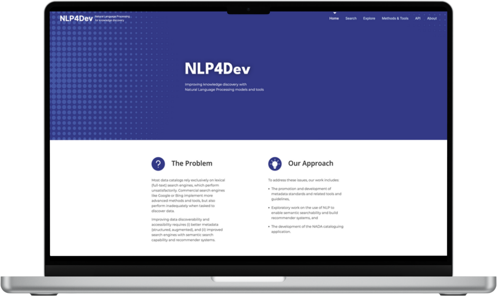

# Digitizing Government Data

The World Bank DEC and Digital Development teams can support training government statistical offices on: digitizing paper data records and transferring data that resides on desktops into cloud-based databases. Further, the DEC Office of the Chief Statistician can provide support for piloting Large Language Model (LLM) and AI-based methods to help governments quickly tag and search their existing data, using natural language queries.

## Digitizing Data

The World Bank Development Economics Data Group (DECDG) supports National Statistical Offices on both modernizing data collection methods (see next chapter) and digitizing existing data. Data digitalization is critical to unlocking the value of decades of historical data and trends, supporting informed decisionmaking moving forward. 

<iframe width="843" height="474" src="https://www.youtube.com/embed/3iOEhPIR75o" title="World Bank Program for Digitizing Business Statistics in the Ivory Coast" frameborder="0" allow="accelerometer; autoplay; clipboard-write; encrypted-media; gyroscope; picture-in-picture; web-share" allowfullscreen></iframe>

> In this video, the DEC Data Group (DECDG) team works with the Ivory Coast National Statistical Office on digitizing business statistics surveys and setting up a system for electronic data collection moving forward. 

## Making Data Discoverable with AI

The World Bank Development Economics Data Group (DECDG) is leading Bank efforts to build flexible, open source tools that government counterparts can use to tag and search hundreds of thousands of government documents and records. The leading product, [NLP4Dev](https://www.nlp4dev.org/), supports out-of-the-box advanced semantic search, with a code package that can be implemented and maintained by locally-based developers.

> *Fig. 1* The Natural Language Processing for Development ([NLP4Dev](https://www.nlp4dev.org/)) platform, led by the DEC Data Group, is an open-source library and application to quickly transform government documents into searchable text and insights. 

