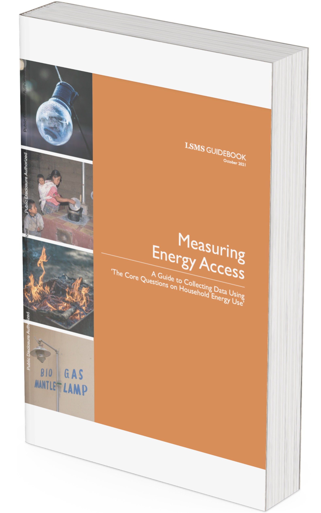

# New Data Collection

In addition to leveraging existing data sources, the World Bank can support government training and implementation assistance for new data collection -- through household surveus, remote sensing, and crowdsourcing methods.

## Household Surveys

The World Bank is a preminent global advisor on government household survey data collection design and implementation in developing countries.

|  |  |  |
| --------------------------------------------------------------------------------------------------------------------------------------------------------------- | ----------------------------------------------------------------------------------------------------------------- | ---------------------------------------- |

## Remote Sensing and Drones

In addition to existing remote sensing data resources described above, Bank teams can task new remote sensing data collection, using a combination of vendors and in-house expertise. DEC's Geospatial Operations Support Team (GOST) can support new satellite imagery tasking, while the Global Faciltiry for Disaster Risk Reduction (GFDRR) can support new field drone data collection. For both data collection methods, the ITS GeoLab can support imagery storage, processing, and access.

## Crowdsourcing

Crowdsourcing can be an economical and quick means to collect data across a large area that may otherwise be difficult to capture. Crowdsourcing can include field data collection via mobile application for image capture (e.g., streetview imagery, advertised goods prices) and/or short-answer questions, survey on a social media platform, or web-based data labeling tasks using a crowd-sourced work platform.

## Data Management

For newly collected data, the DEC Development Data Hub team can provide support for formatting, tagging, and hosting collected datasets.

# Recommendations

For this Data Good, the team recommends <insert recomendation(s) for the case country/countries>
