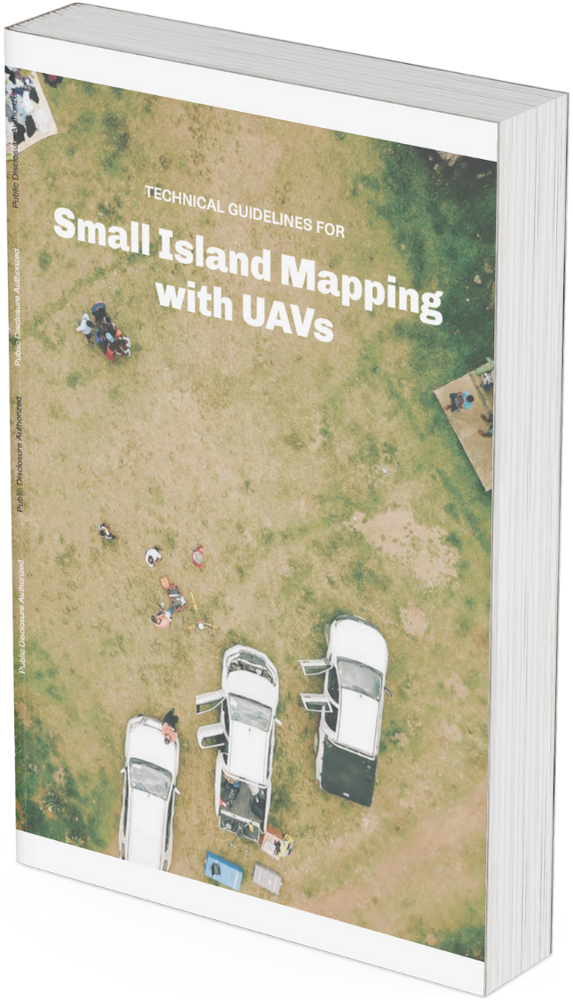
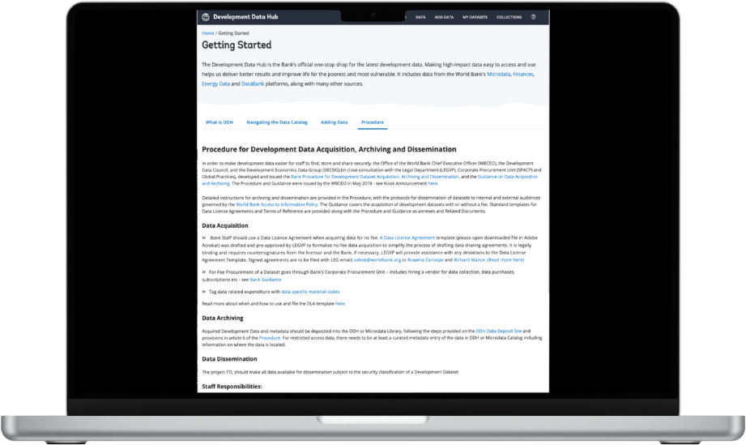

# New Data Collection

In addition to leveraging existing data sources, the World Bank can support government training and implementation assistance for new data collection -- through household surveus, remote sensing, and crowdsourcing methods.

## Household Surveys

The World Bank is a preminent global advisor on government household survey data collection design and implementation in developing countries.

For example, the [Living Standards Measurement Study (LSMS)](https://www.worldbank.org/en/programs/lsms), housed in the DEC Data Group, is a household survey program that  that helps policymakers improve government services for health, education, economic growth, housing, and utilities. To date, the World Bank has led more than 150 LSMS household survey programs, with results accesisble via the World Bank [Microdata Library](https://microdata.worldbank.org/index.php/catalog/lsms/?page=1&ps=15&repo=lsms). Most importantly, the LSMS team routinely collaborates with the Regions and Practice Groups to conduct custom household surveys that directly support lending and technical assistance operations. 

|  |  |  |
| --------------------------------------------------------------------------------------------------------------------------------------------------------------- | ----------------------------------------------------------------------------------------------------------------- | ---------------------------------------------------------------------------------------------------------------------------------------------------------------------------------------------------- |

> *Fig. 1* The LSMS team regularly produces guidebooks and template survey materials for governments. The above links to gudelines for forestry, energy, and education surveys are clickable and lead to the original materials. 

## Remote Sensing and Drones

In addition to existing remote sensing data resources described above, Bank teams can task new remote sensing data collection, using a combination of vendors and in-house expertise. DEC's Geospatial Operations Support Team (GOST) can support new satellite imagery tasking and advisory, while the Global Faciltiry for Disaster Risk Reduction (GFDRR) can support new field drone data collection. For both data collection methods, the ITS GeoLab can support imagery storage, processing, and access.

> *Fig. 2* The DEC Geospatial Operations Support Team (GOST) commissioned the industry-standard introductory resource for using satellite imagery in international development work – [The State of Satellites](https://landscape.satsummit.io/).

| xxxxxxxxx | xxxxxxxxxx |  | xxxxxxxxxx | xxxxxxxxxx |
| ------------------------------------------ | ------------------------------------------- | ---------------------------------- | ------------------------------------------- | ------------------------------------------- |

> *Fig. 3* GFDRR leads the World Bank’s government capacity building efforts to collect drone imagery for public sector programs. This is the cover of GFDRR's recently published guide on [Small Island Mapping with Unmanned Aerial Vehicles (UAVs)](https://openknowledge.worldbank.org/server/api/core/bitstreams/d58af8a7-ee74-5567-9fa3-4aaf5f9050e8/content).

> *Fig 4* The [ITS GeoLab](https://geowb.worldbank.org/portal/apps/Cascade/index.html?appid=4818a534d02245179c120b7aa21598b6) supports task teams on drone vendor procurement, image processing, and image storage. 

## Crowdsourcing

Crowdsourcing can be an economical and quick means to collect data across a large area that may otherwise be difficult to capture. Crowdsourcing can include field data collection via mobile application for image capture (e.g., streetview imagery, advertised goods prices) and/or short-answer questions, survey on a social media platform, or web-based data labeling tasks using a crowd-sourced work platform.

> *Fig. 5*[ Laomap.org](https://www.laomap.org/), created by WB Data Lab Task Team to support field transport data crowdsourcing -- mapping rural roads for a lending program, capturing streetview imagery, and collecting post-flood road data -- and government training. 

| xxxxxxxxxx | xxxxxxxxxx |  | xxxxxxxxxx | xxxxxxxxxx |
| ------------------------------------------- | ------------------------------------------- | -------------------------------- | ------------------------------------------- | ------------------------------------------- |

> *Fig. 6* This is a screen capture from an AWS Mechanical Turk crowdsourced task prepared by the Data Lab, where thousands of on-line workers were requested to identify rooftop features for use in a disaster risk management investment program in St. Lucia, led by Sarah Antos, Senior Land Administration Specialist.

## Data Management

For newly collected data, the DEC Development Data Hub team can provide support for formatting, tagging, and hosting collected datasets.

> *Fig. 7*  The DEC Data Group’s Development Data Hub team has extensive experience designing and implementing data acquisition, archiving, and dissemination policies and governance. For more information, see: [Development Data Hub](https://datacatalog.worldbank.org/int/getting-started)

# Recommendations

For this Data Good, the team recommends <insert recomendation(s) for the case country/countries>
