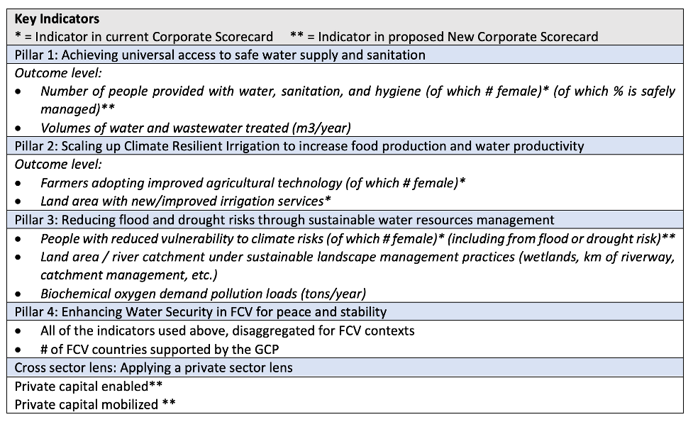

# Foundational Data: Proposal

The Clean Water and Sanitation Global Challenge Program  seeks to strengthen water security and increase access to safe water supply and sanitation through systems change and investing in the scale-up of more sustainable water management and disaster risk reduction solutions. To this end, the Approach Paper annex presents data requirements to measure outcomes in the four GCP Pillars. Following is an excerpt from the paper:

> Measuring the various outcomes listed in the GCP pillars requires data on various indicators including access to safe water supply and sanitation, irrigation practices, flood and drought risk, water resource mapping, and conflict risk. The GCP will support, and piggyback on on-going World Bank led data collection initiatives and data partnerships. For example, DECDG supports data production on WASH, irrigation, and climate risk related information and collaborates with relevant institutions in this area to ensure data are used both to monitor global and national goals as well as to support World Bank projects. These initiatives can be further strengthened to meet the data requirements of each pillar, which are described as follows.

> **Pillar 1: Achieving universal access to safe water supply and sanitation**. Information needed to measure safely managed water and sanitation services is limited. In selected strategic countries, the GCP will support household surveys that combine a water quality module with granular information on drinking water quality and sanitation services. Relevant World Bank led initiatives can be leveraged and further strengthened to monitor the progress under the GCP include the Living Standards Measurement Study (LSMS), which will be launching a new program on longitudinal high-frequency multi-topic household surveys known as Resilient Futures. Measuring the outcomes under this pillar also calls for collaboration with external partners, including the Joint Monitoring Programme - UNICEF and WHO.

> **Pillar 2: Scaling up climate resilient irrigation to increase food production and water productivity**. To measure climate resilient irrigation coverage, the GCP will support ongoing survey initiatives, including the Living Standards Measurement Study and the 50x30 Initiative, to collect gender disaggregated information on irrigation practices, adoption of technologies, and other improved inputs. The GCP will coordinate with DEC and relevant GPs to support WB-led knowledge and learning platforms and investing in government data systems and capacity building programs. 

> **Pillar 3: Reducing flood and drought risks through sustainable water resources management**. Key GCP outcomes listed under this pillar could be supported through monitoring by satellite remote sensing – using both open and commercially available sources – for a scaled and rapid approach to understanding climatic impacts on GCP objectives. The DECDG Geospatial Operations Support Team (GOST) manages several master license agreements with satellite imagery and remote sensing data providers. And the Development Data Partnership also supports data partnerships relevant to this pillar (e.g., JBA Risk Management). Lastly, the aforementioned longitudinal survey program, Resilient Futures, will be supporting mix-mode household survey systems that will be interoperable with geospatial data sources and derived products to understand the micro-level resilience to and impacts of extreme weather events and that will also provide opportunities for in-situ sensor deployments in sampled communities to obtain highly-localized measurements of climatic events that may otherwise be missed due to the deficiencies in the spatial and temporal resolution of publicly available satellite imagery and derived geospatial data products.

> **Pillar 4: Enhancing Water Security in FCV for peace and stability.** The GCP will support data activities indicated above in FCV contexts. In addition, the GCP will leverage relevant data partnerships (e.g., Armed Conflict Location & Event Data Project (ACLED) to measure and monitor conflict risk to safe water supply and access.

The Global Challenge Approach Paper also presents key indicators for monitoring:

> 

## Existing Data

As a first step, the team will explore options to curate a hosted collection of relevant datasets, including but not limited to:

* Spatial population and demographics

* Spatial distribution of wealth

* Location of surface natural freshwater resources and spatial trends in their increase/descrease

* Location of flood plains /  risk zones

* Historical spatial statistics for drought and rainfall

* Location of agriculture facilities

* Location of basic infrastructure, including roads and buildings, and points of interest, such as schools and health facilities

* Disease surveillence data for illnesses associated with contaminated water and poor sanitation (e.g., cholera, diarrhoea, dysentery, hepatitis A, typhoid, and polio)

* Spatial and temporal inventory of international development organization investments in WASH facilities

* WASH consumables purchase data (e.g., from Unilever)

* Previously conducted household survey results (e.g., LSMS), formatted for ease of access and use

* Conflict event data (geospatial)

* Aggregated news and media mentions of poor WASH conditions

  

## Digitizing Government Data

As a pilot, the team can work with a specific counry client to aggregate and digitize existing paper records or tag and format existing digital records. These would then be hosted on a server (location depending on local data regulations) and made easily searchable and discoverable through an open-source AI-based document and data discovery platform developed by the World Bank. 

## New Data Collection

* The **Living Standards Measurement Study (LSMS)** is launching a new program on longitudinal high-frequency multi-topic household surveys, known as Resilient Futures. Through coordination with the Water Global Practice, the survey questions can be tailored to ensure they support measurement of access to safe water supply and sanitation, irrigation practices, and sustainable water resource management practices. 
* The team can use remote sensing techniques to monitor 

