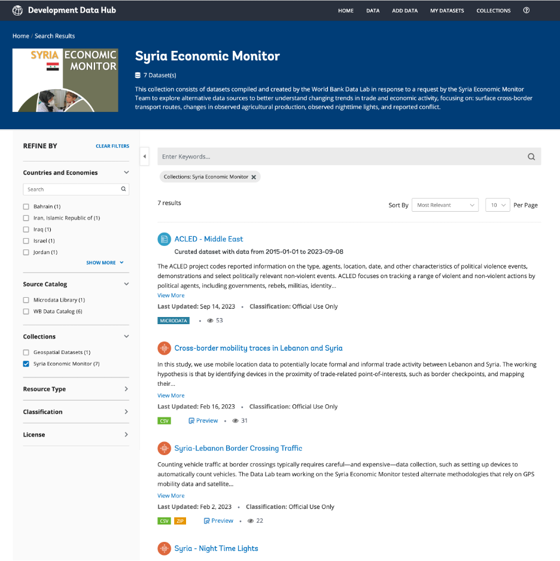

# Insights and Indicators

This section shows how Foundational Datasets and Reusable Data Products can be combined to generate new insights and indicators.

For this Data Good, the team has prepared the followign sample insights and indicators: <insert recomendation(s) for the case country/countries>

## Datasets Table

The  Datasets table includes a description of the data and their update frequency, as well as access links and contact information for questions about use and access.

Following is an example table used to support bi-weekly infrastructure damage estimates for the MTI economics team responsible for the World Bank response to the Gaza-Israel conflict:

| ID   | Name                                              | License                                 | Description                                                  | Update Frequency                             | Access                                                       | Contact                                                      |
| ---- | ------------------------------------------------- | --------------------------------------- | ------------------------------------------------------------ | -------------------------------------------- | ------------------------------------------------------------ | ------------------------------------------------------------ |
| 1    | Palestine - Subnational Administrative Boundaries | Open                                    | Admin boundaries up to level 2                               | Every year (Last updated in 20 October 2023) | [HDX](https://data.humdata.org/dataset/cod-ab-pse)           | [Data Lab](mailto:datalab%40worldbank.org)                   |
| 2    | NASA’s Black Marble Nighttime Lights              | Open                                    | Visible infrared imaging radiometer suite (VIIRS) nighttime lights | Daily                                        | [NASA’s Black Marble](http://blackmarble.gsfc.nasa.gov/)     | [Geospatial Operations Support Team](mailto:gost%40worldbank.org) or [Data Lab](mailto:datalab%40worldbank.org) |
| 3    | ACLED                                             | Accessible to WB Staff using an API key | Crowdsourced conflict event database                         | Daily                                        | [ACLED Data Export Tool](https://acleddata.com/data-export-tool/) | [Data Lab](mailto:datalab%40worldbank.org)                   |
| 4    | WorldPop                                          | Open                                    | Population density estimates data                            | 2020                                         | [WorldPop](https://hub.worldpop.org/geodata/summary?id=46388) | [Data Lab](mailto:datalab%40worldbank.org)                   |
| 5    | OpenStreetMaps                                    | Open                                    | Points of interest                                           | Daily                                        | [HdX](https://data.humdata.org/search?q=palestine&ext_search_source=main-nav) | [Data Lab](mailto:datalab%40worldbank.org)                   |
| 6    | Microsoft Building Footprints                     | Open                                    | Building footprints                                          | N/A                                          | [GitHub](https://github.com/microsoft/GlobalMLBuildingFootprints) | [Data Lab](mailto:datalab%40worldbank.org)                   |

## Data Catalog Collection

For open datasets, the Data Lab works with the DECDG Development Data Hub team to create a 'collection' in the [World Bank Data Catalogue](https://datacatalog.worldbank.org/int/home) to ensure all datasets are readily accessible by the project team, government counterparts, and third parties. 

For example, the Data Lab worked with the DEC Data Group (DECDG) Development Data Hub team to create a special [Syria Economic Monitor collection](https://datacatalog.worldbank.org/int/getting-started) in the World Bank Data Catalogue to ensure all project data can be easily accessed by the team and third parties. Similar collections can be made for other Data Goods packages, to ensure all data are hosted and readily accessible from one place.

