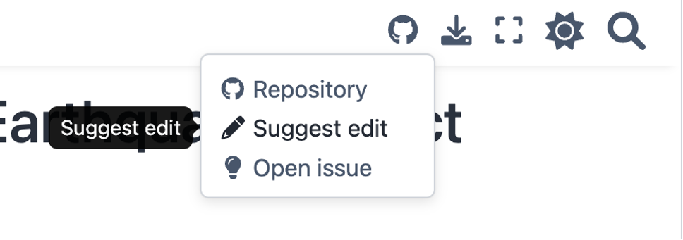

# Training and Dissemination

## Data Goods Package Dissemination

All Data Goods, by default, are made freely available via web books-- in the same format at the web book you are reading. Following are some examples:

* [Syria Economic Monitor: Using Alternative Data to Uncover Economic Trends](https://datapartnership.org/syria-economic-monitor/README.html)
* [Turkiye Earthquake Economic Imapct Analytics](https://datapartnership.org/turkiye-earthquake-impact/README.html#)
* [Gaza-Israel Conflict Damage Monitoring](https://datapartnership.org/gaza-israel-conflict-impact-analysis/notebooks/nighttime-lights/nighttime-lights.html)

Web books can be auto-translated into more than 130 languages. Click the following links for examples of translations of the web book you are now reading:

| <a href="https://holly--transport-github-io.translate.goog/goods-template/README.html?_x_tr_sl=en&_x_tr_tl=fr&_x_tr_hl=en&_x_tr_pto=wapp">	<button style="background-color: teal; color: white; padding: 10px 20px; border: none; text-align: center; text-decoration: none; display: inline-block; font-size: 16px; margin: 5px; cursor: pointer; border-radius: 5px;">French</button></a> | <a href="https://holly--transport-github-io.translate.goog/goods-template/README.html?_x_tr_sl=en&_x_tr_tl=sw&_x_tr_hl=en&_x_tr_pto=wapp">	<button style="background-color: teal; color: white; padding: 10px 20px; border: none; text-align: center; text-decoration: none; display: inline-block; font-size: 16px; margin: 5px; cursor: pointer; border-radius: 5px;">Swahili</button></a> | <a href="https://holly--transport-github-io.translate.goog/goods-template/README.html?_x_tr_sl=en&_x_tr_tl=zh-CN&_x_tr_hl=en&_x_tr_pto=wapp">	<button style="background-color: teal; color: white; padding: 10px 20px; border: none; text-align: center; text-decoration: none; display: inline-block; font-size: 16px; margin: 5px; cursor: pointer; border-radius: 5px;">Mandarin</button></a> |
| ------------------------------------------------------------ | ------------------------------------------------------------ | ------------------------------------------------------------ |

Web books can be presented as websites or downloaded as pdfs, and all readers can suggest edits or raise issues using the web book navigation bar, creating a new level of interaction with recipients of World Bank analytical work:

| xxxxxxx | xxxxxxxx |  | xxxxxxxx | xxxxxxxx |
| ---------------------------------------- | ----------------------------------------- | ------------------------- | ----------------------------------------- | ----------------------------------------- |

Web books do not require any funding for hosting, and they can be freely duplicated, updated, or added to by the community. Further, all usage can be freely monitored in real time, providing a reliable indicator of utility. 

## Custom Training

## DEC Global Institute

DEC Global Institute......
