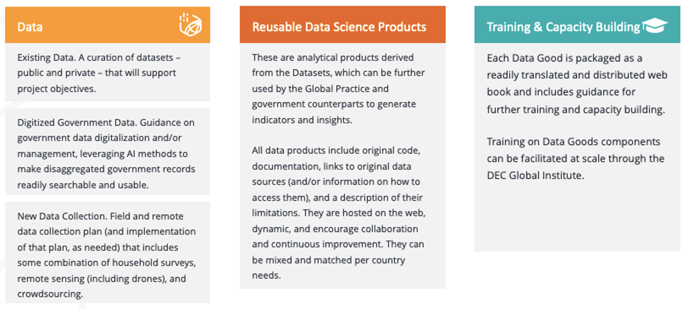
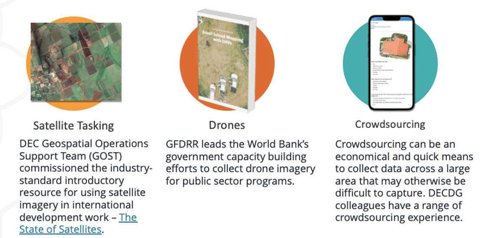

# Data Good Example: Water Global Practice

## Objectives

The World Bank Water Global Practice seeks to guide the shift from fragmented strategies to **data-driven water plans** for countries facing water-related challenges. These strategies should be systematic, with methods scalable across countries. To achieve this goal, the Water GP may enhance internal data analytics capabilities and leverage connections to internal data science teams and data resources. The data-driven water plans should take advantage of freely available global data, including remote sensing and modeling outputs, to guide work and inform clients in data-scarce environments. 

Through collaboration, this Data Good will suppot the creation of **globally applicable first-tier tools** for water management tasks and **second-tier methods and tools for in-depth data analysis**, tailored to specific country needs; **address data gaps** to help client countries transition from data poor to data and information rich; and support the deevlopment of **blueprints and pioneering country examples** to motivate and guide other countries towards data-driven, evidence-based water decision-making.

## Clean Water and Sanitation Global Challenge Program

The Clean Water and Sanitation Global Challenge Program  seeks to strengthen water security and increase access to safe water supply and sanitation through systems change and investing in the scale-up of more sustainable water management and disaster risk reduction solutions. To this end, the Approach Paper annex presents data requirements to measure outcomes in the four GCP Pillars. Following is an excerpt from the paper:

> Measuring the various outcomes listed in the GCP pillars requires data on various indicators including access to safe water supply and sanitation, irrigation practices, flood and drought risk, water resource mapping, and conflict risk. The GCP will support, and piggyback on on-going World Bank led data collection initiatives and data partnerships. For example, DECDG supports data production on WASH, irrigation, and climate risk related information and collaborates with relevant institutions in this area to ensure data are used both to monitor global and national goals as well as to support World Bank projects. These initiatives can be further strengthened to meet the data requirements of each pillar:
> 
> * Pillar 1: Achieving universal access to safe water supply and sanitation.
> * Pillar 2: Scaling up climate resilient irrigation to increase food production and water productivity
> * Pillar 3: Reducing flood and drought risks through sustainable water resources management
> * Pillar 4: Enhancing Water Security in FCV for peace and stability.

Through the GCP process, the Water GP has clearly articulated its priorities and goals. Whether or not the GCP proceeds, the Water GP can still be supported in acheivement of these data and analytical goals, through preparation of a Data Good, per the following proposed work plan.

## Data Good Components

To support acheivement of these objectives and idenitified needs for the GCP, a Data Good can be prepared around three components:

1. Data
2. Reusable Data Science Products
3. Insights and Indicators
4. Training and Capacity Building

The finally-produced package -- data, data science products, and capacity building materials -- would include all relevant outputs and materials for a pilot country *and* be scaleable and customizable to be fully replicated in new countries. 

### 1 Data

#### 1a Existing Data

As a first step, the team will explore options to curate a hosted collection of relevant existing datasets, including but not limited to:

* Spatial population and demographics

* Spatial distribution of wealth

* Location of surface natural freshwater resources and spatial trends in their increase/descrease

* Location of flood plains /  risk zones

* Historical spatial statistics for drought and rainfall

* Location of agriculture facilities

* Location of basic infrastructure, including roads and buildings, and points of interest, such as schools and health facilities

* Disease surveillence data for illnesses associated with contaminated water and poor sanitation (e.g., cholera, diarrhoea, dysentery, hepatitis A, typhoid, and polio)

* Spatial and temporal inventory of international development organization investments in WASH facilities

* WASH consumables purchase data (e.g., from Unilever)

* Previously conducted household survey results (e.g., LSMS), formatted for ease of access and use

* Conflict event data (geospatial)

* Aggregated news and media mentions of poor WASH conditions

The team can support the the [**World Bank Water Data Portal**](https://wbwaterdata.org/) by contributing harmonized statistics derived from previously conducted and planned WB-led [Living Standards Measurement Study](https://microdata.worldbank.org/index.php/catalog/lsms/?page=1&ps=15&repo=lsms) household surveys, supporting analysis of risks to safe water supply and access, especially in FCVs. The team can support adding other relevant datasets not already included in the Portal, such as water pricing data collected through the World Bank's [International Comparisons Program](https://www.worldbank.org/en/programs/icp) and freshwater statistics through the [World Development Indicators](https://wdi.worldbank.org/table/3.5). 

Finally, the team can support **World Bank Water Data Portal Improvements**  with additional funcitonality that supports AI-based document and data discovery, such as using the DECDG open source platform, [NLP4Dev](https://www.nlp4dev.org/). 

#### 1b Digitalized Government Data

The team may support country pilots in using language learning models and generative AI to expedite digitizing water-related records (e.g., auto-tagging with meta data) and improving data and information discoverability – water, climate, and other datasets being coordinated through other GCPs. Discoverability would be improved through use of natural language queries, which would help increase government uptake. Depending on the status of data digitization, data discoverability pilots can be implemented, scaled, and reproduced relatively quickly across the portfolio through DPL and TA components of IPF programs, led by the WB Data Catalogue team.

The outputs of this task would include:

* Customizable Web-Based Guidebook for Digitizing Water Ministry (and/or other relevant and participating Government Department) Paper Records

* Cutomizable Web-Based Guidebook for Water Data Management (e.g, making existing data discoverable, sharable, and usable).

* Customizable Web-Based Training Materials (Script, Presentations, Hands-On Exercises, etc.) for Pilot Government Counterpart on Data Digitization and Management

* Open-Source Code for Using Large Language Models (LLMs) to Make Water Data Discoverable

* Custom Catalogue Platform (with user interface design and hosting supported by a local vendor) for Data Discovery

* Implementation Support in Pilot Country

#### 1c New Data Collection

The Lab team will discuss new data collection needs with the Water GP based on their most urgent priorities. For starters, the Lab recommends inclusion of the followign two methods in a new data collection plan. 

* The **Living Standards Measurement Study (LSMS)** is launching a new program on longitudinal high-frequency multi-topic household surveys, known as Resilient Futures. Through coordination with the Water Global Practice, the survey questions can be tailored to ensure they support measurement of access to safe water supply and sanitation, irrigation practices, and sustainable water resource management practices. 
  * For example, in support of GCP **Pillar 1: Achieving universal access to safe water supply and sanitation**, the team can support household surveys that combine a water quality module with granular information on drinking water quality and sanitation services. The LSMS will be launching a new program on longitudinal high-frequency multi-topic household surveys known as *Resilient Futures.* The team would also support collaboration with Joint Monitoring Programme partners UNICEF and WHO to coordinate pillar measurements.
  
  * Under **Pillar 2:** **Scaling up Climate Resilient Irrigation to increase food production and water productivity**, to measure climate resilient irrigation coverage, the team will draw upon ongoing sLSMS and [50x30 Initiative](https://mcas-proxyweb.mcas.ms/certificate-checker?login=false&originalUrl=https%3A%2F%2Fwww.50x2030.org.mcas.ms%2F%3FMcasTsid%3D15600&McasCSRF=811056e08dfbeadfeef2d24cadc9049c00b7c0b629a9bdf6433b9fb2d46a88a7) surveys to collect gender disaggregated information on irrigation practices, and adoption of technologies.
  
  * Under **Pillar 3: Reducing flood and drought risks through sustainable water resources management**, the *Resilient Futures* progra led by DECDG will support mix-mode household survey systems that will be interoperable with geospatial data sources and derived products to understand the micro-level resilience to  and impacts of extreme weather events and that will also provide opportunities for in-situ sensor deployments in sampled communities to obtain highly-localized measurements of climatic events that may otherwise be missed due to the deficiencies in the spatial and temporal resolution of publicly available satellite imagery and derived geospatial data products.
  
    
  
  This work would build on existing programs that are currently executed on an ad-hoc basis, but through the GCP, can be more systemized under a common framework. For example, the WB currently supports government data production on WASH, irrigation, and climate risk related information and collaborates with relevant institutions in this area (JMP- UNICEF and WHO) to ensure data are used both to monitor global and national goals as well as to support World Bank projects. To illustrate, a DECDG team designed and trained the Ethiopian government on implementation drinking water quality surveys in collaboration with the Joint Monitoring Programme of UNICEF and WHO – [Drinking water quality surveys in Ethiopia,.](https://microdata.worldbank.org/index.php/catalog/2783/related-materials) This work informed a US$300m IDA program, “[One WASH](https://documents1.worldbank.org/curated/en/577341560737014064/pdf/Ethiopia-Consolidated-Water-Supply-Sanitation-and-Hygiene-Account-Project.pdf)” as well as [official SDG 6 reporting](https://www.sdg6data.org/en/country-or-area/ethiopia#anchor_6.1.1). Further, the team followed the survey work by designing methods for [addressing gaps in data on drinking water quality through data integration and machine learning](https://www.nature.com/articles/s41545-023-00272-8). 

* Several aspects of the GCP could be supported through monitoring by **remote sensing** – using both open and commercially available sources – for a scaled and rapid approach to understanding climatic impacts on GCP objectives.

  
  
  
  
  

### 2 Reusable Data Products

Following are ideas for reusable data science products that can be applied to the datasets pooled together under the Data Good packge for use by Bank teams, country clients, and third parties to support better water management decsionmaking. 

* [Spatial and Temporal Drought Index Generator](https://datapartnership.org/morocco-economic-monitor/docs/drought-summary.html). Using Standard Precipitation Index (SPI) data to map drought index in a country.

* [Spatial and Temporal Vegetation Index Generator](https://datapartnership.org/syria-economic-monitor/notebooks/vegetation-conditions/README.html). Agricultural droughts severely impact seasonal crop production. The impact of drought -- or improvements to irrigation -- on vegetation conditions can be studied using NDVI data.

* <u>Population Vulnerability to Drought and Flood Estimator</u>. Mapping SPI, population, poverty, and spatial flood risk data to identify areas where vulnerable populations are most exposed to flood and drought risk.  

* <u>Vulnerability of International River Basins in a Changing Climate  Estimator</u>. International river basins will likely face higher hydrologic variability due to climate change. Increased floods and droughts would have economic and political consequences. Riparians of transboundary basins governed by water treaties could experience non-compliance and inter-state tensions if flow falls below levels presumed in a treaty. 

* <u>Population Vulnerability due to Sea Level rise and Storm Surge  Estimator</u>. Hundreds of millions of families living in coastal areas worldwide face a range of risks related to climate change. Leveraging advancement in remote sensing measurement, detailed [population](https://mcas-proxyweb.mcas.ms/certificate-checker?login=false&originalUrl=https%3A%2F%2Fwww.popgrid.org.mcas.ms%2F%3FMcasTsid%3D15600&McasCSRF=811056e08dfbeadfeef2d24cadc9049c00b7c0b629a9bdf6433b9fb2d46a88a7) and [economic](https://mcas-proxyweb.mcas.ms/certificate-checker?login=false&originalUrl=https%3A%2F%2Fdatacatalog.worldbank.org.mcas.ms%2Fdataset%2Fgross-domestic-product-2010%3FMcasTsid%3D15600&McasCSRF=811056e08dfbeadfeef2d24cadc9049c00b7c0b629a9bdf6433b9fb2d46a88a7) data represent an essential component in the quantification of vulnerability in a changing climate. 

### 3 Insights and Indicators

With the curated Datasets and new Data Products, the team can support development and publication of new statistics that support GCP indicator requirements for hosting on the Water Data Portal, such as:

* <u>Baseline Spatial Location and Number of People Vulnerable to Flood and Drought Risk</u> for use in analyzing impact of sustainable water resource management programs.
* <u>Baseline Spatial Agricultural Relative Yield Index</u> for use in analyzing impact of investments in improved irrigation services and mnew agriculture technology.

### 4 Training and Capacity Building

*Pending Discussions*
